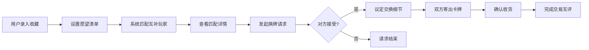

## 1. 产品概述

卡牌收藏与换牌平台，为卡牌游戏玩家提供个人藏品管理、卡牌检索、换牌匹配与交易沟通的一站式服务。解决卡牌收藏爱好者找卡难、换卡不便、管理混乱的痛点，打造可信的卡牌交换社区。

- 目标用户：集换式卡牌游戏（TCG）玩家、卡牌收藏爱好者
- 核心价值：高效管理藏品、智能匹配换牌对象、安全便捷的交易流程

## 2. 核心功能

### 2.1 用户角色

| 角色 | 注册方式 | 核心权限 |
|------|----------|----------|
| 普通用户 | 用户名/邮箱注册 | 浏览卡牌图鉴、管理个人收藏、发起换牌请求、站内沟通 |

### 2.2 功能模块

1. **首页**：平台介绍、热门卡牌展示、换牌动态、快速入口
2. **卡牌图鉴**：全量卡牌数据库、按系列/稀有度筛选、卡图与规则详情
3. **我的收藏**：录入持有卡牌、标记品相/语言、批量导入、收藏统计
4. **愿望清单**：设置想要的卡牌、优先级标记、完成度追踪
5. **换牌匹配**：自动匹配互补玩家、匹配度评分、筛选条件设置
6. **交易沟通**：发起换牌请求、议定差额、站内留言、物流确认
7. **套牌检测**：套牌列表导入、缺卡检测、获取渠道推荐
8. **个人中心**：个人信息、交换历史、信誉评分、屏蔽管理

### 2.3 页面详情

| 页面名称 | 模块名称 | 功能描述 |
|-----------|-------------|---------------------|
| 首页 | Hero 区域 | 平台标语、核心价值展示、CTA 按钮 |
| 首页 | 热门卡牌 | 展示近期热门/高价值卡牌，点击进入详情 |
| 首页 | 换牌动态 | 实时滚动展示成功换牌案例 |
| 首页 | 快速入口 | 八大功能模块快捷导航卡片 |
| 卡牌图鉴 | 筛选栏 | 按系列、稀有度、颜色、类型多条件筛选 |
| 卡牌图鉴 | 卡牌网格 | 响应式卡牌展示网格，悬停显示预览 |
| 卡牌图鉴 | 卡牌详情 | 高清卡图、规则文本、价格参考、版本信息 |
| 我的收藏 | 收藏列表 | 持有卡牌展示，支持数量调整和品相标记 |
| 我的收藏 | 批量操作 | 批量导入、批量修改、导出清单 |
| 我的收藏 | 统计面板 | 收藏总数、系列分布、稀有度分布、估值统计 |
| 愿望清单 | 愿望列表 | 想要的卡牌展示，优先级标记 |
| 愿望清单 | 完成度 | 愿望清单完成进度、获取推荐 |
| 换牌匹配 | 匹配列表 | 展示互补玩家列表，匹配度评分排序 |
| 换牌匹配 | 匹配详情 | 双方卡牌互补详情、可换卡牌对比 |
| 交易沟通 | 请求列表 | 发出/收到的换牌请求管理 |
| 交易沟通 | 聊天界面 | 站内消息、卡牌议价、数量议定 |
| 交易沟通 | 物流追踪 | 寄出确认、收货确认、交易状态 |
| 套牌检测 | 套牌导入 | 粘贴套牌列表或上传文件 |
| 套牌检测 | 缺卡分析 | 对比收藏，显示缺卡数量和来源推荐 |
| 个人中心 | 基本信息 | 头像、昵称、联系方式设置 |
| 个人中心 | 交换历史 | 历史交易记录、评价管理 |
| 个人中心 | 信誉系统 | 信誉评分、成功交易次数 |
| 个人中心 | 屏蔽管理 | 屏蔽/解除屏蔽用户 |

## 3. 核心流程

### 3.1 用户主要流程

用户注册登录后，首先浏览卡牌图鉴了解卡牌信息，然后录入自己的收藏到"我的收藏"，同时在"愿望清单"中添加想要的卡牌。系统通过"换牌匹配"自动找出拥有用户想要的卡牌且需要用户拥有卡牌的其他玩家。用户可以向匹配玩家发起换牌请求，通过"交易沟通"议定换牌细节，确认后双方寄出卡牌并确认收货，完成交易并互评。玩家还可以使用"套牌检测"功能检查构建特定套牌还缺少哪些卡牌。

### 3.2 换牌匹配流程图

## 4. 用户界面设计

### 4.1 设计风格

- **主色调**：深紫色 (#6D28D9) 搭配金色 (#F59E0B)，营造神秘高贵的卡牌收藏氛围
- **辅助色**：深色背景 (#1F2937)、卡片白 (#F9FAFB)、成功绿 (#10B981)、警示红 (#EF4444)
- **按钮风格**：圆角胶囊按钮，主按钮带金色渐变和微光泽效果
- **字体**：标题使用 Cinzel 装饰性衬线字体，正文使用 Lato 无衬线字体
- **布局风格**：卡片式布局，金色细边框，微妙的阴影层次，卡牌翻转动效
- **图标风格**：线性图标搭配金色点缀，卡牌元素主题

### 4.2 页面设计概览

| 页面名称 | 模块名称 | UI 元素 |
|-----------|-------------|-------------|
| 首页 | Hero 区域 | 深色渐变背景、金色装饰边框、大标题发光效果、悬浮卡牌动效 |
| 卡牌图鉴 | 筛选栏 | 金色边框筛选容器、标签式筛选、搜索框带放大镜图标 |
| 卡牌图鉴 | 卡牌网格 | 响应式网格布局、卡牌悬停放大效果、稀有度颜色标识 |
| 我的收藏 | 统计面板 | 数据卡片带金色图标、进度条动画、数字滚动效果 |
| 换牌匹配 | 匹配卡片 | 双方头像对向排列、匹配度环形进度条、互补卡牌对比 |
| 交易沟通 | 聊天界面 | 消息气泡设计、卡牌快捷插入、状态时间线 |
| 套牌检测 | 分析结果 | 缺卡红色标记、已有卡牌绿色标记、进度仪表盘 |
| 个人中心 | 信誉展示 | 星级评分、徽章系统、时间线历史记录 |

### 4.3 响应式设计

- 采用桌面优先设计，适配 1920px、1440px、1024px 主流分辨率
- 平板端：网格列数自适应，侧边栏可折叠
- 移动端：底部导航栏，单列布局，卡片堆叠展示
- 触摸优化：增大点击热区，支持滑动操作

### 4.4 动画与交互

- 页面加载：元素淡入上移，错落有致的延迟效果
- 卡牌交互：悬停时轻微上浮+发光阴影，点击时有 3D 翻转动效
- 按钮交互：按下时微缩，渐变光效扫过
- 状态切换：平滑的淡入淡出过渡，模态框弹性动画
- 数据更新：数字滚动动画，进度条填充动画
