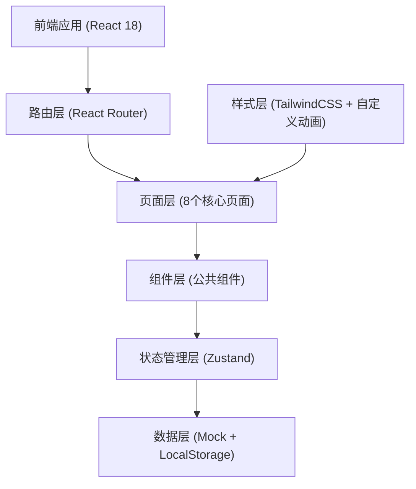
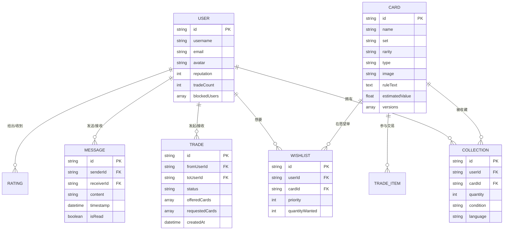

## 1. 架构设计



## 2. 技术选型

- **前端框架**：React@18.2.0
- **构建工具**：Vite@5.0.0
- **路由方案**：React Router@6
- **状态管理**：Zustand@4（轻量级，适合中小型应用）
- **样式方案**：TailwindCSS@3 + CSS 变量 + 自定义动画
- **图标库**：Lucide React（精美线性图标）
- **数据持久化**：LocalStorage（存储用户数据）
- **后端**：无，使用 Mock 数据模拟后端接口

## 3. 目录结构

```
src/
├── pages/              # 页面组件
│   ├── Home.jsx        # 首页
│   ├── CardAtlas.jsx   # 卡牌图鉴
│   ├── MyCollection.jsx# 我的收藏
│   ├── Wishlist.jsx    # 愿望清单
│   ├── TradeMatch.jsx  # 换牌匹配
│   ├── Chat.jsx        # 交易沟通
│   ├── DeckCheck.jsx   # 套牌检测
│   └── Profile.jsx     # 个人中心
├── components/         # 公共组件
│   ├── Layout/         # 布局组件 (Header, Sidebar, Footer)
│   ├── Card/           # 卡牌相关组件
│   ├── UI/             # 通用 UI 组件 (Button, Modal, Input 等)
│   └── Trade/          # 交易相关组件
├── store/              # 状态管理
│   ├── useCardStore.js # 卡牌数据 store
│   ├── useUserStore.js # 用户数据 store
│   └── useTradeStore.js# 交易数据 store
├── data/               # Mock 数据
│   ├── cards.js        # 卡牌数据库
│   ├── users.js        # 用户数据
│   └── trades.js       # 交易数据
├── styles/             # 全局样式
│   └── globals.css     # 全局样式 + Tailwind 指令
├── utils/              # 工具函数
│   ├── match.js        # 匹配算法
│   └── storage.js      # 本地存储封装
├── App.jsx             # 应用入口
├── main.jsx            # React 入口
└── index.css           # 样式入口
```

## 4. 路由定义

| 路由路径 | 页面名称 | 说明 |
|---------|---------|------|
| / | 首页 | 平台介绍、热门卡牌、快速入口 |
| /atlas | 卡牌图鉴 | 全量卡牌浏览与筛选 |
| /collection | 我的收藏 | 个人藏品管理 |
| /wishlist | 愿望清单 | 想要的卡牌管理 |
| /match | 换牌匹配 | 匹配互补玩家 |
| /chat | 交易沟通 | 消息与交易管理 |
| /deck-check | 套牌检测 | 套牌缺卡分析 |
| /profile | 个人中心 | 用户信息与设置 |

## 5. 数据模型

### 5.1 数据模型 ER 图



### 5.2 核心数据类型定义

```typescript
// 卡牌类型
interface Card {
  id: string;
  name: string;
  set: string;
  rarity: 'common' | 'uncommon' | 'rare' | 'mythic' | 'legendary';
  type: string;
  image: string;
  ruleText: string;
  estimatedValue: number;
  versions: CardVersion[];
}

interface CardVersion {
  language: string;
  condition: string;
  price: number;
}

// 用户类型
interface User {
  id: string;
  username: string;
  avatar: string;
  reputation: number;
  tradeCount: number;
  blockedUsers: string[];
}

// 收藏项
interface CollectionItem {
  cardId: string;
  quantity: number;
  condition: string;
  language: string;
}

// 愿望清单项
interface WishlistItem {
  cardId: string;
  priority: 1 | 2 | 3;
  quantityWanted: number;
}

// 交易请求
interface TradeRequest {
  id: string;
  fromUserId: string;
  toUserId: string;
  status: 'pending' | 'accepted' | 'rejected' | 'shipped' | 'completed';
  offeredCards: TradeCard[];
  requestedCards: TradeCard[];
  createdAt: Date;
}

interface TradeCard {
  cardId: string;
  quantity: number;
  condition?: string;
}
```

## 6. 状态管理设计

### 6.1 CardStore - 卡牌数据管理

```typescript
interface CardStore {
  cards: Card[];
  filteredCards: Card[];
  filters: {
    set?: string;
    rarity?: string;
    search?: string;
  };
  setFilters: (filters: object) => void;
  getCardById: (id: string) => Card | undefined;
}
```

### 6.2 UserStore - 用户与收藏管理

```typescript
interface UserStore {
  currentUser: User;
  collection: CollectionItem[];
  wishlist: WishlistItem[];
  addToCollection: (cardId: string, data: object) => void;
  removeFromCollection: (cardId: string) => void;
  addToWishlist: (cardId: string, priority: number) => void;
  removeFromWishlist: (cardId: string) => void;
  blockUser: (userId: string) => void;
  unblockUser: (userId: string) => void;
}
```

### 6.3 TradeStore - 交易与匹配管理

```typescript
interface TradeStore {
  matches: MatchResult[];
  tradeRequests: TradeRequest[];
  messages: Message[];
  calculateMatches: () => MatchResult[];
  sendTradeRequest: (targetUserId: string, cards: object) => void;
  acceptTrade: (tradeId: string) => void;
  rejectTrade: (tradeId: string) => void;
  sendMessage: (receiverId: string, content: string) => void;
}
```

## 7. 匹配算法设计

### 7.1 互补匹配逻辑

1. **双向需求匹配**：用户 A 想要的卡牌在用户 B 的收藏中，且用户 B 想要的卡牌在用户 A 的收藏中
2. **匹配度评分**：
   - 基础分：匹配卡牌数量 × 10
   - 稀有度加成：稀有卡 × 2，神话卡 × 3
   - 优先级加成：愿望清单高优先级 × 1.5
   - 信誉加成：对方信誉分 × 0.1
3. **排序展示**：按匹配度从高到低排列

### 7.2 套牌检测逻辑

1. 解析用户输入的套牌列表（支持文本粘贴/文件上传）
2. 逐一比对用户收藏中的卡牌数量
3. 标记：
   - 绿色：数量充足
   - 黄色：数量不足
   - 红色：完全没有
4. 计算完成度百分比
5. 推荐获取渠道（愿望清单、匹配玩家、购买链接）

## 8. 性能优化方案

- 卡牌图片懒加载（Intersection Observer）
- 虚拟滚动处理大量卡牌列表
- 状态按需更新，避免不必要的重渲染
- 本地缓存常用数据，减少重复计算
- 防抖处理搜索输入

## 9. 开发规范

- 组件命名：PascalCase，页面组件后缀为 Page
- 文件命名：组件使用 PascalCase，工具函数使用 kebab-case
- 样式：优先使用 Tailwind 类名，复杂样式使用 CSS 模块
- Git 提交：`type: description` 格式
- 代码格式化：Prettier + ESLint
